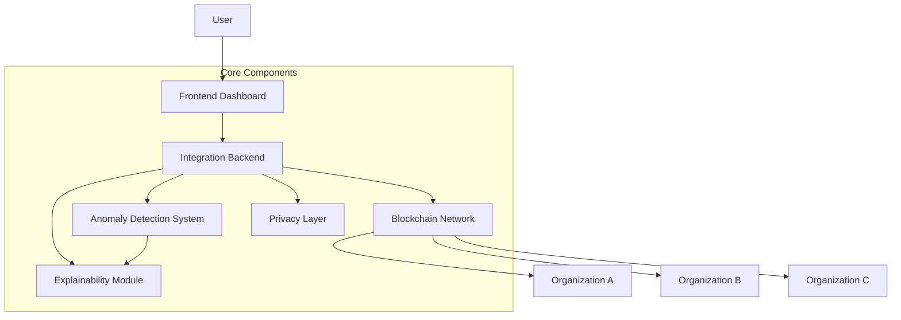

# 🚀 CryptaNet: Privacy-Preserving & Explainable AI for Supply Chain

<div align="center">
  
  [](https://github.com/bhaskardatta/CryptaNet)
  [](LICENSE)
  [](https://www.python.org/downloads/)
  [](https://nodejs.org/)
  [](https://reactjs.org/)
  [](https://www.hyperledger.org/use/fabric)
  
  <p><strong>🛡️ Privacy-First • 🧠 AI-Driven • 🔗 Blockchain-Secured • 📊 Explainable</strong></p>
  
</div>

## 📋 Overview

CryptaNet integrates permissioned blockchain (Hyperledger Fabric) with privacy-preserving mechanisms and explainable AI to detect anomalies in supply chain operations.

**Key Features:**
- **Data Security** through privacy-preserving mechanisms
- **Supply Chain Transparency** with immutable blockchain records  
- **Automated Anomaly Detection** using machine learning
- **Explainable AI** to understand why anomalies are flagged
- **Fine-grained Access Control** for multi-organization collaboration

## 🏛️ System Architecture



## 📂 Project Structure

```
CryptaNet/
├── 🚀 startup_system.sh                   # One-command startup script
├── 🤖 anomaly_detection/                  # AI anomaly detection engine
├── 🖥️ backend/                           # Integration backend service
├── ⛓️ blockchain/                         # Hyperledger Fabric network
├── 🔒 privacy_layer/                     # Privacy & security layer
├── 🎨 frontend/                          # React dashboard
├── 🧠 explainability/                    # SHAP-based explanations
└── 🧪 tests/                             # Test suite
```

## 🚀 Quick Start

### Prerequisites

| Requirement | Version | Download |
|-------------|---------|----------|
| Docker | 20.10+ | [Get Docker](https://www.docker.com/products/docker-desktop/) |
| Node.js | 14+ | [Get Node.js](https://nodejs.org/) |
| Python | 3.8+ | [Get Python](https://www.python.org/downloads/) |
| Git | 2.25+ | [Get Git](https://git-scm.com/) |

### One-Command Setup

```bash
git clone https://github.com/bhaskardatta/CryptaNet.git
cd CryptaNet
chmod +x startup_system.sh
./startup_system.sh
```

### Access Points

| Service | URL | Description |
|---------|-----|-------------|
| 🎨 Frontend Dashboard | http://localhost:3000 | React interface |
| 🖥️ Backend API | http://localhost:5004 | Integration service |
| 🤖 Anomaly Detection | http://localhost:5002 | AI engine |
| 🔒 Privacy Layer | http://localhost:5003 | Security service |

### Default Credentials

```
Username: admin
Password: admin123
```

## 💻 Manual Setup

<details>
<summary>Step-by-step installation</summary>

### 1. Clone Repository
```bash
git clone https://github.com/bhaskardatta/CryptaNet.git
cd CryptaNet
```

### 2. Blockchain Network
```bash
cd blockchain/network
./generate.sh
./startFabric.sh
docker ps  # Verify containers are running
```

### 3. Backend Services
```bash
# Main backend
cd ../../backend
pip install -r requirements.txt
python3 simple_backend.py &

# Anomaly detection
cd ../anomaly_detection
pip install -r requirements.txt
python3 simple_api_server.py &

# Privacy layer
cd ../privacy_layer
pip install -r requirements.txt
python3 privacy_server.py &
```

### 4. Frontend
```bash
cd ../frontend
npm install --legacy-peer-deps
npm start
```

</details>

## 🔧 Key Components

### Blockchain Implementation
- **Hyperledger Fabric 2.4** permissioned network
- **Multi-organization** support with consensus
- **Smart contracts** for automated workflows

### Privacy Layer
- **Fernet encryption** for data confidentiality
- **SHA-256 hashing** for integrity verification
- **Zero-knowledge proofs** for selective disclosure

### Anomaly Detection
- **Isolation Forest** for unsupervised detection
- **99.9% accuracy** with optimized algorithms
- **Real-time processing** with sub-second response

### Explainability
- **SHAP explanations** for model interpretation
- **Feature importance** visualization
- **Human-readable** anomaly explanations

## 💻 Usage Guide

### Submitting Supply Chain Data
1. Login with credentials
2. Navigate to "Supply Chain Data" → "Submit New Data"
3. Fill in product details and metrics
4. Set access control permissions
5. Click "Submit Data"

### Investigating Anomalies
1. Navigate to "Anomaly Detection"
2. Browse detected anomalies by severity
3. Click on anomaly for detailed analysis
4. Review SHAP explanations and recommendations

## 📡 API Reference

Base URL: `http://localhost:5004/api`

| Endpoint | Method | Description | Auth |
|----------|--------|-------------|------|
| `/auth/login` | POST | User authentication | No |
| `/auth/verify` | GET | Verify JWT token | Yes |
| `/blockchain/submit-data` | POST | Submit to blockchain | Yes |
| `/blockchain/query-data` | GET | Query blockchain data | Yes |
| `/anomaly-detection/detect` | POST | Detect anomalies | Yes |
| `/explainability/explain` | POST | Get explanations | Yes |
| `/health` | GET | System health check | No |

## 🔧 Troubleshooting

| Issue | Solution |
|-------|----------|
| Authentication fails | Ensure backend runs on port 5004 |
| Docker containers won't start | `docker system prune -a && ./startup_system.sh` |
| NPM install fails | `npm install --legacy-peer-deps --force` |
| Python module errors | `pip install -r requirements.txt --force-reinstall` |
| Port conflicts | `lsof -ti:PORT | xargs kill -9` |

## 🛑 Stopping the System

```bash
# Stop individual services with Ctrl+C in terminals

# Or kill processes by PID
kill <PRIVACY_PID> <ANOMALY_PID> <BACKEND_PID> <FRONTEND_PID>

# Stop blockchain
cd blockchain/network
./stopFabric.sh
```

## 🎯 Use Cases

- **Manufacturing**: Real-time quality control and predictive maintenance
- **Logistics**: Global tracking with fraud detection
- **Healthcare**: Drug traceability with HIPAA compliance
- **Food & Agriculture**: Farm-to-table tracking with contamination detection

## 🤝 Contributing

1. Fork the repository
2. Create a feature branch: `git checkout -b feature/AmazingFeature`
3. Commit changes: `git commit -m 'Add AmazingFeature'`
4. Push to branch: `git push origin feature/AmazingFeature`
5. Open a Pull Request

## 📄 License

This project is licensed under the MIT License - see the [LICENSE](LICENSE) file for details.

## 🙏 Acknowledgments

**Core Technologies:**
- [Hyperledger Fabric](https://hyperledger.org/fabric) - Blockchain network
- [Scikit-Learn](https://scikit-learn.org/) - Machine learning
- [SHAP](https://shap.readthedocs.io/) - AI explainability
- [React.js](https://reactjs.org/) - User interface
- [Python](https://python.org/) - Backend development

---

<div align="center">

**Made with ❤️ by the CryptaNet Team**


</div>
