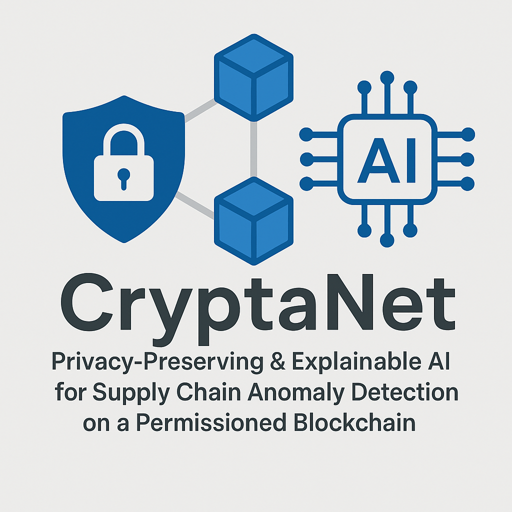
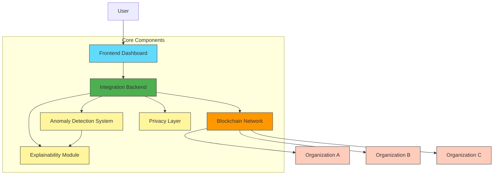
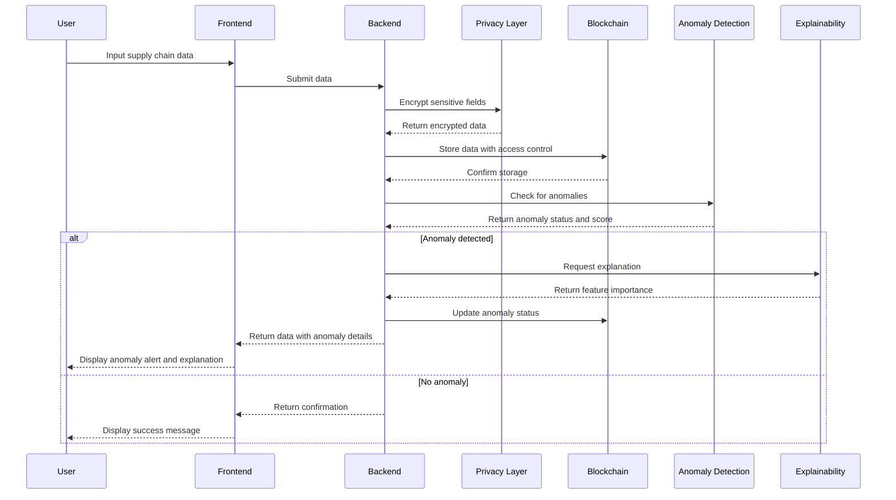
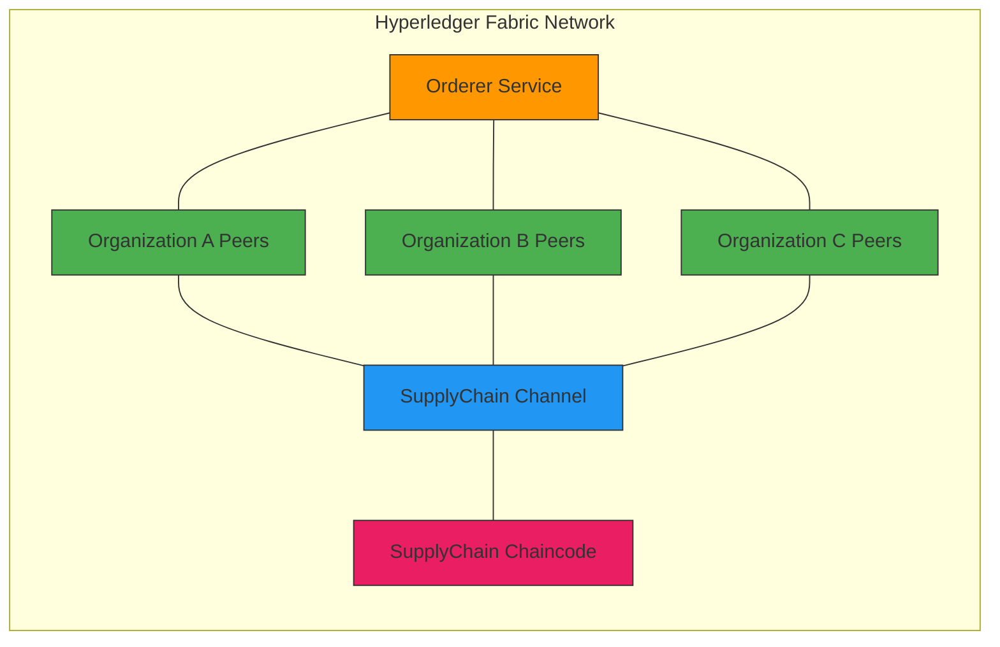
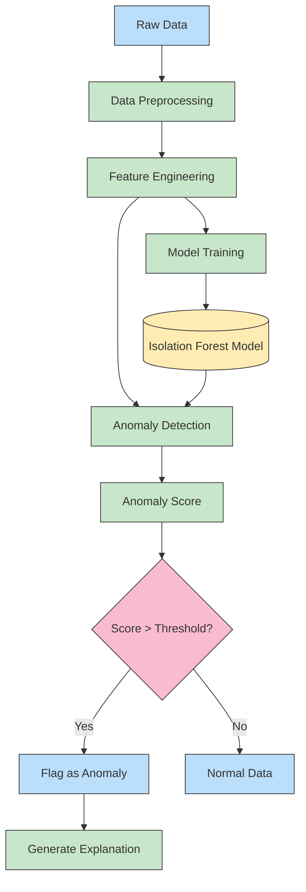

# CryptaNet: Privacy-Preserving & Explainable AI for Supply Chain Anomaly Detection

<div align="center">
  
  <br>
  <strong>Secure · Transparent · Explainable</strong>
  <br><br>
  
  [](LICENSE)
  [](https://www.python.org/downloads/)
  [](https://nodejs.org/)
  [](https://reactjs.org/)
  [](https://www.hyperledger.org/use/fabric)
</div>

---

## 📋 Overview

CryptaNet is a comprehensive system that integrates permissioned blockchain technology (Hyperledger Fabric) with privacy-preserving mechanisms and explainable AI to detect anomalies in supply chain operations.

The system provides:
- **Data Security** through privacy-preserving mechanisms
- **Supply Chain Transparency** with immutable blockchain records
- **Automated Anomaly Detection** using machine learning
- **Explainable AI** to understand why anomalies are flagged
- **Fine-grained Access Control** for multi-organization collaboration

## 🏛️ System Architecture



The CryptaNet system consists of the following components:

1. **Permissioned Blockchain Network**: Hyperledger Fabric implementation with multiple organizations
2. **Privacy Layer**: Encryption and hashing mechanisms for data confidentiality and integrity
3. **Anomaly Detection System**: Machine learning pipeline using Isolation Forest for detecting supply chain anomalies
4. **Explainability Module**: SHAP-based interpretability layer for explaining detected anomalies
5. **Integration Backend**: Flask-based backend connecting all components
6. **Frontend Dashboard**: React.js-based user interface for visualization and monitoring

## 📂 Directory Structure

```
CryptaNet/
├── blockchain/                  # Hyperledger Fabric network configuration
│   ├── chaincode/              # Smart contracts (chaincode)
│   ├── network/                # Network configuration files
│   └── docker/                 # Docker configuration for blockchain
├── privacy_layer/              # Privacy-preserving mechanisms
│   ├── encryption/             # Symmetric encryption using Fernet
│   ├── hashing/                # SHA-256 hashing for data integrity
│   └── zkp/                    # Zero-knowledge proof implementation
├── anomaly_detection/          # Machine learning pipeline
│   ├── preprocessing/          # Data preprocessing modules
│   ├── models/                 # Isolation Forest implementation
│   ├── feature_engineering/    # Feature engineering for supply chain data
│   └── evaluation/             # Model evaluation scripts
├── explainability/             # Explainability module
│   ├── shap/                   # SHAP implementation for model interpretation
│   ├── visualization/          # Feature importance visualization
│   └── explanation_api/        # API for retrieving explanations
├── backend/                    # Integration backend
│   ├── api/                    # RESTful API endpoints
│   ├── auth/                   # Authentication and authorization
│   ├── events/                 # Event listeners for blockchain
│   └── data_flow/              # Data flow management
├── frontend/                   # React.js-based dashboard
│   ├── src/                    # Source code
│   ├── public/                 # Public assets
│   └── package.json            # Dependencies
└── docs/                       # Documentation
    └── architecture/           # System architecture overview
```

## 🚀 Installation and Setup

### Prerequisites

Before starting, ensure you have the following installed:

| Requirement | Version | Description |
|-------------|---------|-------------|
| Docker      | 20.10+  | Container platform |
| Docker Compose | 1.29+ | Multi-container management |
| Node.js     | 14+     | JavaScript runtime |
| Python      | 3.8+    | Programming language |
| Git         | 2.25+   | Version control |
| curl        | -       | Command line data transfer tool |

### 1. Clone the Repository

```bash
git clone https://github.com/bhaskardatta/CryptaNet.git
cd CryptaNet
```

### 2. Set Up the Blockchain Network

```bash
# Navigate to the blockchain directory
cd blockchain

# For Apple Silicon Macs (M1/M2/M3)
cd docker
./pull-fabric-images-arm64.sh
cd ..

# Generate crypto material and channel artifacts
cd network
./generate.sh

# Start the Fabric network
./startFabric.sh

# Verify containers are running
docker ps
```

#### Troubleshooting Blockchain Setup

| Issue | Solution |
|-------|----------|
| Docker containers not starting | Run `docker system prune -a` to clear system resources and retry |
| Network port conflicts | Check for process using port 7050/7051 with `lsof -i :7050` and stop it |
| Crypto-config generation error | Clear the crypto-config directory and run `./generate.sh` again |
| Access denied error | Run the commands with `sudo` if needed |

### 3. Set Up the Backend

```bash
# Navigate to the backend directory
cd backend

# Install Python dependencies
pip install -r requirements.txt

# If you have permission issues with pip install, try:
pip install --user -r requirements.txt

# Start the backend server (new port 5001 configuration we confirmed works)
python api/app.py
```

The backend server will start at [http://localhost:5001](http://localhost:5001)

#### Troubleshooting Backend Setup

| Issue | Solution |
|-------|----------|
| Missing Python modules | Run `pip install --no-cache-dir -r requirements.txt` |
| Port already in use | Change port in `app.py` or terminate existing process |
| Module import errors | Ensure your Python path includes the project root with `export PYTHONPATH=$PYTHONPATH:/path/to/CryptaNet` |
| JWT token errors | Check that the secret key in `app.py` matches any existing configuration |

### 4. Set Up the Frontend

```bash
# Navigate to the frontend directory
cd frontend

# Install Node.js dependencies (use legacy-peer-deps flag for React 18 compatibility)
npm install --legacy-peer-deps

# Start the frontend development server
npm start
```

The frontend development server will start at [http://localhost:3000](http://localhost:3000)

#### Troubleshooting Frontend Setup

| Issue | Solution |
|-------|----------|
| Node.js dependency conflicts | Use `npm install --legacy-peer-deps` instead of regular npm install |
| Module not found errors | Try `npm cache clean --force` and reinstall with `--legacy-peer-deps` |
| Port already in use | Press `Y` when prompted to use an alternative port |
| React version mismatch | Update Material-UI dependencies if needed |
| "Invalid token" login errors | Check that backend URL is correct (should be port 5001) |

## 📊 Data Flow



## 🔐 Authentication and Access

### User Access Levels

CryptaNet implements a role-based access control system:

| Role | Access Level | Capabilities |
|------|--------------|--------------|
| Admin | Full | Train models, manage users, view all data |
| User | Standard | Submit/query data, view explanations |
| Guest | Limited | View public data only |

### Login Credentials (Default)

```
Admin User:
  - Username: admin
  - Password: admin

Regular User:
  - Username: user
  - Password: user
```

## 🛠️ Key Components

### 1. Blockchain Implementation



The blockchain component uses Hyperledger Fabric to create a permissioned network with multiple organizations. It includes:

- Network configuration for + organizations
- Channel configuration for private data sharing
- Smart contracts for data storage, access control, and event emission

### 2. Privacy Layer

The privacy layer ensures data confidentiality and integrity through:

- Symmetric encryption using Fernet
- SHA-256 hashing for data integrity verification
- Zero-knowledge proof implementation for selective disclosure

### 3. Anomaly Detection System



The anomaly detection system uses machine learning to identify unusual patterns:

- Data preprocessing for supply chain metrics
- Isolation Forest for unsupervised anomaly detection
- Feature engineering for supply chain-specific attributes
- Configurable anomaly scoring system

### 4. Explainability Layer

The explainability layer makes AI decisions transparent and understandable:

- SHAP (SHapley Additive exPlanations) for model interpretation
- Feature importance visualization
- Human-readable explanations for detected anomalies

### 5. Integration Backend

The backend system connects all components and provides APIs for the frontend:

- RESTful APIs for frontend communication
- Authentication and authorization
- Event listeners for blockchain events
- Data flow management between components

### 6. Frontend Dashboard

The React.js-based dashboard provides a user-friendly interface:

- Real-time supply chain data visualization
- Anomaly alerts with severity indicators
- Detailed explanation views for detected anomalies
- Interactive charts using D3.js

## 💻 Usage Guide

### Submitting Supply Chain Data

1. Log in with your credentials
2. Navigate to "Supply Chain Data" section
3. Select "Submit New Data" tab
4. Fill in the product details and supply chain metrics
5. Set appropriate access control
6. Click "Submit Data"

### Querying Data

1. Navigate to "Supply Chain Data" section
2. Select "Query Data" tab
3. Set filter parameters (data type, time range)
4. Click "Query"
5. View results in the table
6. Click the "eye" icon to view detailed information

### Viewing Anomalies

1. Navigate to "Anomaly Detection" section
2. View the list of detected anomalies
3. Click on an anomaly to see details
4. Review the explanation and feature importance

### Training Anomaly Models (Admin Only)

1. Navigate to "Anomaly Detection" section
2. Select "Train Model" tab
3. Configure training parameters
4. Click "Train Model"

## 🔧 Common Issues and Solutions

| Issue | Solution |
|-------|----------|
| **Authentication fails** | Ensure backend is running on port 5001 and API URL is correctly set in frontend config |
| **"Not Found" when accessing backend** | The root URL now shows API documentation; use specific endpoints or check URL |
| **Data submission errors** | Check required fields and data format; review browser console for detailed errors |
| **Blockchain network unreachable** | Ensure all Docker containers are running with `docker ps` and network is properly initialized |
| **Model training fails** | Check for sufficient data; review Python error logs for specific issues |
| **Frontend display issues** | Clear browser cache or try in incognito mode; check console for JS errors |
| **Missing module errors** | Run `pip install -r requirements.txt` in backend dir or `npm install --legacy-peer-deps` in frontend dir |

## 📋 API Reference

Base URL: `http://localhost:5001/api`

| Endpoint | Method | Description | Authentication Required |
|----------|--------|-------------|-------------------------|
| `/auth/login` | POST | User login | No |
| `/auth/verify` | GET | Verify token | Yes |
| `/auth/profile` | GET | Get user profile | Yes |
| `/blockchain/submit-data` | POST | Submit data to blockchain | Yes |
| `/blockchain/query-data` | GET | Query data from blockchain | Yes |
| `/privacy/encrypt` | POST | Encrypt data | Yes |
| `/privacy/decrypt` | POST | Decrypt data | Yes |
| `/anomaly-detection/detect` | POST | Detect anomalies | Yes |
| `/anomaly-detection/train` | POST | Train model | Yes (Admin) |
| `/explainability/explain` | POST | Explain anomaly | Yes |
| `/health` | GET | Check system health | No |

## 📝 Development and Extension

### Adding New Features

The modular architecture allows for extending each component:

1. **Frontend**: Add new components in `frontend/src/components/`
2. **Backend**: Add new API endpoints in `backend/api/app.py`
3. **Blockchain**: Add new chaincode functions in `blockchain/chaincode/supplychain/`
4. **Anomaly Detection**: Extend detection algorithms in `anomaly_detection/models/`

### Testing Changes

Always test your changes before committing:

```bash
# Backend tests
cd backend
pytest tests/

# Frontend tests
cd frontend
npm test
```

## 🔄 Starting and Stopping the System

### Full System Startup

```bash
# Start Blockchain Network
cd blockchain/network
./startFabric.sh

# Start Backend
cd ../../backend
python api/app.py

# Start Frontend
cd ../frontend
npm start
```

### System Shutdown

```bash
# Stop Frontend (Ctrl+C in terminal)

# Stop Backend (Ctrl+C in terminal)

# Stop Blockchain Network
cd ../blockchain/network
./stopFabric.sh

# If blockchain containers are stubborn, use:
docker-compose -f ../docker/docker-compose.yaml down --volumes --remove-orphans
```

## 📄 License

This project is licensed under the MIT License - see the [LICENSE](LICENSE) file for details.

## 👏 Acknowledgments

- Hyperledger Fabric community
- scikit-learn developers
- SHAP developers
- React.js community
- Material-UI team